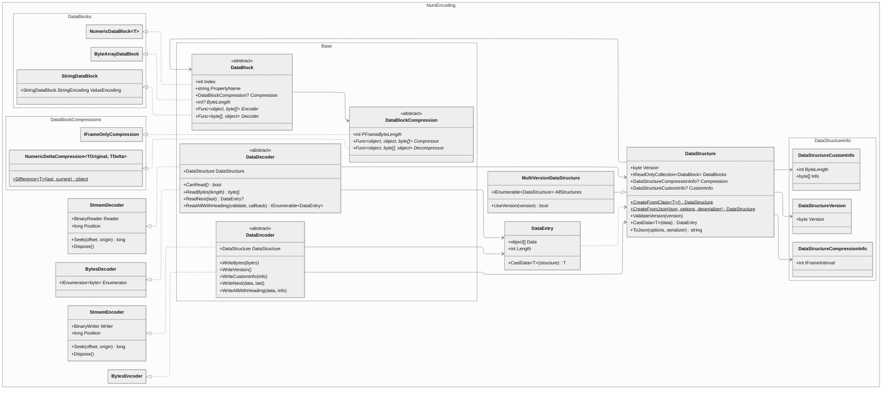

# NumEncoding: _An Adaptable Encoding & Decoding Library for Arbitrary Data Structures_

[](https://docs.microsoft.com/en-us/dotnet/csharp/)
[](https://dotnet.microsoft.com/en-us/download/dotnet/8.0)
[](https://github.com/Fei-Sheng-Wu/NumEncoding/blob/master/LICENSE.txt)

## Introduction

NumEncoding is a data encoding and decoding library implemented under .Net 8.0. It is designed to support all one-dimensional data structures and can directly translate C# classes into the described format. Aimed to be scalable and customizable, the library exposes necessary functionalities for one to easily personalize for their own demand.

### Quick Start

Create a data structure from a class:

```c#
DataStructure myStructure = DataStructure.CreateFromClass<MyClass>();
```

```c#
[DataStructureVersion(1)]
[DataStructureCompressionInfo(IFrameInterval = 20)]
[DataStructureCustomInfo(2, [0, 255])]
public class MyClass
{
    [NumericDataBlock<uint>]
    [IFrameOnlyCompression]
    public uint MyValue1 { get; set; }

    [NumericDataBlock<short>]
    [NumericDeltaCompression<short, sbyte>]
    public short MyValue2 { get; set; }
}
```

Create data entries from a list of objects:

```c#
List<MyClass> myData = [...];
IEnumerable<DataEntry> dataEntries = myData.Select(x => myStructure.CastData(x))
```

Encode data:

```c#
using (FileStream stream = new("C:/path/to/output_file", FileMode.Create))
{
    using (StreamEncoder encoder = new(myStructure, stream))
    {
        encoder.WriteAllWithHeading(dataEntries);

        //Or with custom info at predefined length:
        //encoder.WriteAllWithHeading(dataEntries, [255, 255]);
    }
}
```

Decode data:

```c#
using (FileStream stream = new("C:/path/to/input_file", FileMode.Open))
{
    using (StreamDecoder decoder = new(myStructure, stream))
    {
        IEnumerable<DataEntry> decodedDataEntries = decoder.ReadAllWithHeading();
    }
}
```

## Encoding Protocol

### Overall Structure

A data structure defined in NumEncoding needs to include:

1. the version number as the identifier
2. the collection of data blocks that form each data entry
3. _(Optional)_ the general compression info that is consistent throughout the entirety of the encoded data
4. _(Optional)_ the custom info to be put into the structure heading section of the encoded data

The final encoded data may appear as:

| Version<br/>_(1 byte)_  | Custom Info<br/>_(predefined length)_ | Data Entry #1 | Data Entry #2 | ... |
| :---: | :---: | :---: | :---: | :---: |
| 00000001  | [...]  | [...]  | [...]  | |

### Data Entry

Consider a data structure defined to use the following data blocks:

| `Byte`<br/>_(1 byte)_ | `Byte`<br/>_(1 byte)_ | `UInt16`<br/>_(2 bytes)_ | `String`<br/>_(variable length)_ |
| :---: | :---: | :---: | :---: |

Each data entry may be encoded as:

```text
01010101010101010101010101010101[...]00000000
```

| | `Byte`<br/>_(1 byte)_ | `Byte`<br/>_(1 byte)_ | `UInt16`<br/>_(2 bytes)_ | `String`<br/>_(variable length)_ |
| :---: | :---: | :---: | :---: | :---: |
| Encoded | 01010101 | 01010101 | 0101010101010101 | [...]00000000
| Original | 85 | 85 | 21845 | [...] |

### Data Block

Each data block may either have a predefined length or a variable length, which is represented by a `int?` value that defines the length in bytes or uses `null` to indicate a variable length.

**For a data block with a predefined length**, the encoder and the decoder will strictly write or read the specified number of bytes.

**For a data block with a variable length**, the encoder and the decoder will write the encoded data with a following byte `00000000` or keep reading the data until a byte `00000000` is read.

> [!NOTE]
> Each data block contains their own encoder and decoder functions, making it possible to customize and expand the functionalities for one's specialized use cases.

> [!TIP]
> A data block is associated with a priority index and a property name, but these are fully optional for default data block implementations when they are used as attributes, where the property name is automatically attained and the line number is automatically used as the index.

### Compression

When compression is applied, each data entry may be identified as either an I-frame or a P-frame, where I-frame data entries store the lossless data, and P-frame data entries only store the compressed data that can be used to predict the original data in accordance with previous data entries.

When a data block is invoked to encoded the given data and a compression is available, both the given data from the current data entry and the data from the very last data entry will be passed into the compressor, which returns a `byte` array that can be decompressed in a similar fashion, utilizing the last data entry.

> [!NOTE]
> The compression defined in a data block may have a predefined length that is different from the normal length of the data block, making it possible to save the storage expense in P-frame data entries.

The interval of I-frame data entries is defined by the data structure, including a leading I-frame data entry. For example, in the case of the interval being set to 5, it results in:

| Data Entry #1 | Data Entry #2 | Data Entry #3 | Data Entry #4 | Data Entry #5 | Data Entry #6 | Data Entry #7 | ... |
| :---: | :---: | :---: | :---: | :---: | :---: | :---: | :---: |
| **I-frame** | P-frame | P-frame | P-frame | P-frame | **I-frame** | P-frame | |

## Implementation



### Data Blocks

The following data blocks are implemented as the default ones:

- **NumericDataBlock\<T\>**<br/>Represents a described data block with a predefined length that supports `byte`, `sbyte`, `bool`, `char`, `short`, `ushort`, `int`, `uint`, `long`, `ulong`, `double`, and `float` types.<br/>`T` is the type of the data being stored, which must exactly match the type of the provided objects.
- **ByteArrayDataBlock**<br/>Represents a described data block with a variable length that directly operates on byte arrays.
- **StringDataBlock**<br/>Represents a described data block with a variable length that supports `string` objects.

### Data Block Compressions

The following data block compressions are implemented as the default ones:

- **IFrameOnlyCompression**<br/>Represents a compression that only stores data in I-frame data entries.
- **NumericDeltaCompression\<TOriginal, TDelta\>**<br/>Represents a compression that only stores the changes in data for P-frame data entries, which allows for a different type than the provided objects and supports `byte`, `sbyte`, `short`, `ushort`, `int`, `uint`, `long`, `ulong`, `double`, and `float` types.<br/>`TOriginal` is the type of the original I-frame data being stored, which is used for conversion purposes.<br/>`TDelta` is the type of the P-frame data being stored as changes, which does not have to match the type of the provided objects as type conversion is always applied.

### Miscellaneous

**JSON Support:**

`DataStructure` supports conversions from and to JSON texts, using the `ToJson()` and the static `CreateFromJson()` methods. Additionally, custom implemented `DataBlock` and `DataBlockCompression` objects can also be supported with custom parsers.

## Usage Example

A demo project can be found under [NumEncoding.Test](https://github.com/Fei-Sheng-Wu/NumEncoding/tree/master/NumEncoding.Test), where a WPF application utilizes NumEncoding to encode and decode drawing data from the user with lossy compression.

Sample encoded data:

```text
000000011000110011111111000000011000101111111111100010001111111110000111111111111000011111111111100001011111111110000101111111111000010111111011100001011111101110000101111110101000001011110111000000010111111111110100011111001110101001111011111000100111100011011011011101101101001101110101110010110111001111000011011100011011101101110001101101010111000010110010000000010111000010101110011100001010110001110000101010110111000010101001011100001010100101110000101010010111000010101001011100001010100101110000101010010111000010100011000000010110111110100000011011111001111101101111100110110110111110011011011011111001101101101111100110110110111110011011011011111001101101101111100110100110111110011010000000100110110110011000011011011001100001101101100110000110110110010111011011011001011101101100100101110110110010010111011010101001011101101010100101110110100110011000000000110110100110011000011010011001100001101001100110000110100110011000011010011001100001101001100110000110100110011000011010111001011101101101100101110110111010010110000001000111000010010100011100001001010001110001100100110111001010001111011100101000111101110010100011000111001010001100011100101000110001110010100011000111001010001100000001010111001010001011011100001000101101110000100010110110111110001011011011011000110001101100100011010110110010001111011011001001000001101010100100000110101010010010000001100110101010010010011010101001011101101010100110000110101110011011011011011001111001101110100111110111000010011111011100011001111101110001100111110111001010011111000001110111010010011111011101001001110101110101100111010111010110011011011101011001101101110101100110100111010110010111011101011001011001110101100101000111010110010011000010000111010110010011011100111000111101110011100011110111001110001111011100111000111101110011100011110111001110001111011100011000111101110001100011110111000110001111000010010111000110001111011100001000111101110000100011110110111110010000011011111001000001101111100100100110110110010011011011011001001101101101100101010110110110010111000010000110110110010111011011011001100001101110100110010110111010011011011011101001101101110000100110110111000010011100011100011001110001110001100111000111000110011100000001110111000110011100011100011001110001110001100111000111000110011100011100011001110001110001100111000111000110011100011100011001110001110001100111000111000110011100000001100111000110011100011100011001110001110001100111000111001010011111011101001010001101110101101001010111010110100101011101111010100001111001101010000111100110101010000001010111100110101010011110011010101001111001101010100111100110101010011110101010101001111010101010110111110010101011011111001010101101111101101010110111111010101011000001000111111010101011100000001010101110000000101010111000000110101011100000111010100110000011101001111000001110100111100000111010011010000011101001001000001110100011000000111000001110100010100000111010000010000011101000001000001110011111100000101001110110000010100110111000000110011010100000011001101010000001100110000111111110011000000000100111111110010111011111011001011101111101100101110111110010010110011111001001011001111011100101100111101110010110011110111001011001111001100101100111100110010110000000100111100110010110011110001001011001111000100101100111100010010110011110001001011001111000100101100111100010010110011110001001011001111000100101100111101010010100000000110111110010010100011111001001010001111101100100110111111010010011011111101001001110000000100100011000000010001111100000011000111010000011100011101000001110001100000001001000001110001100100000111000110010000011100010111000001110001011100000111000101010000011100010001000001110000111100000111000010110000011100000111000001110000011000001011000001110000010100000111000000010000011100000001000001101111111100000100111111110000001011111100111111101111100011111110111110001111111011111000111110101111100000001010111110101111100011111000111110001111011011111000111100101111101011110000111110101110110011111110111011001111111011101100111111101110101011111110111010110000000000001000111001110000000011100111000000101110011100000010111001110000011011100011000001101110001100001000111000010000110011100001000011001110000100001110111000010000111000000110111000010000111011100001000011101110000100001110111000010000111011100001000011101110000100001110111000010000111011100001000011101110000100001110111000010000111000000100111000010000111011100001000011101110000100001110111000010000111011100001000011101110000100001110111000010000111011100001000011101110000100001110111000010000111000000110111000010000111011100001000011101110000100001110111000010000111011100001000010101110000100000110111000010000010011100001000001001110000100000000111000010000000000000110111000001111111011100000111111101101111011111100110111101111110011011110111111001101101011111100110110101111100011011000111110001101010011111000110101001111100000000100110101001111100011010010111110001101001011111000110100101111100011001110111110001100101011111000110010101111100011001000111110101100100011111010110001101111101000000010110001101111101011000010111111101100001100000000110000110000000011000011000000001100001100000000110000110000000011000011000000001100001100000000110000110000001000000010110000110000001011000011000001101100001100000110110000110000111011000101000100101100100100010110110010010001100011001001000110001100101100011010110010110001101000000010110011010001111011001101000111101100110100011110110011010001111011001101000111101100110100011110110011010001111011001101000111101100110100011110110011010001111000000010110011010001111011001101000111101100110100011110110011010001111011001101000111101100110100011110110011010001111011001101000111101100110100011110110010110001110000000010110010010001110011001001000111001100011100011000110001110001100011000011000110001100000100011000101111010001100010111101000110001011101100011000101101110001100000000100101101110001100010110011000110101011001100011010101100010001101010110001000111101011000100011110101011110010000010101011001000001010101100100100101010110010010000000110101010110010010010101011001001001010101100100100101010110010010010101011001001001010101100100110101010110010101010101011001010101010110100101110101011010010111000000100101011010010111010110001001011101011000100110000101100110011000010110011001100001011001100110000101101010011000010111001001100001011100100110010101110110011001000000010101110110011001010111111001100101100001100110010110001010011001011001001001100101100100100110010110010110011001011001011001100101100101100110010110011010011001000000010110011010011001011001101001100101100110100110010110011010011001011001101001100101100110100110010110011010011001011001101001100101100110100110010110011010011001000000010110011010011001011001101001100101100110100110010110010110011001011001011001100101100101100110010110010010011011011001001001101101100011100111000110000110011110000000100110000110011110011000001001111001011110101000010101111010100001010111011010001101011101101000110101110110100011010110111010010001011011101001000101101110100100000000110101101110100101010110111010010101011011101001010101101110100101010110111010010101011011101001010101101110100101010110111010010101011011101001010101101110100101000001000101110010100111010111011010011101011101101001110101111110100111010111111010100001100001101010000110000110101000011000101010100001100100101010000110010010101000000001010110010110101000011001011010100001100110101010000110011010101000011001101010100001101000101001110110101110100111011010111010011101101011101001100110101110100110000001010110110110100110011011011010011001101101101001100110110110100110011011011010010001101110101001000111000010100100011100001010001101110000101000110111000010100011000001000111000010100011011100001010001101110000101000110111000010100011011100001010001101110000101000100111000010100010011100001010001001110000101000100111000010100010000000110111000010100010011100001010001001110000101000100111000010100011011100001010001101110000101001000110111110100101011011111010011101101111101010100110111110101011000000100110111110101101011011111010110101101111101011010110111110101111011011111011000001101111101100000110111110110000011011111011000101101111101100110110111110110011000000010110111110110011011011111011010001101111101101000111000010110111011100011011101101110001101110110111000110111100011100011011110001110010101111110111010011000000000000010111010011000000011101011100001001110101110000110111010111000011011101011100001101110101110001010111010111000111011101011100100001110111110010010111011111001011000000010111011111001011011110011100110001111001110011000111100111001110011110011100111001111001110011100111100111001110011110011100111001111001110011100111100111001111000000010111100111001111011110011100111101111001110011110111100111001111011110011100111101111001110011110111100111001111011110011100111101111001110011110111100111001111000000010111100111001111011110011100111101111001110011110111100111001111011110011100111101111000110011110111011011001111011100111100111101110001110011010111000011001011000000100110110111001010011011001100101001101100110010100110100111001010011010011100100001100111110010000110011111001000011001011100100001100101110010000110010011001000000000110110010011001000011001001100100001100011110010010110001111001001011000111100101101100001110010110110000111001011011000011100101101100001110010110110000111001100000001000110000111001100011000011100110001100001110011000110000111001100011000011100110001100001110011000110000111001100011001001100111101100101110011110110011011010001000001010110011011010001011010001101000101101001110100010110101111010001011011011101000101101110110100010111000011010001011100001101000101110000110100010111000111010001000001100111000111010001011100101101000101110100110100010111010011010001011101001101000101110100110100010111010011010001011101001101000101110100110100010111010011010001000001110111010011010001011101001101000101110100110100010111010011010001011101001101000101110100110100010111010111010000011110011100110101111001110011010111101011001011000010000111110011001010011111001100101001111101110010000111111011000111011111101100011101111110110001110111111011000111100000001100011110000000110001101000000111000110000001111000000111000110100000011100011010000101110001101000010111000110100001011100011010000101110001101000010111000110100001011100011010000101110001101000010111000110000001101000010111000110100001011100011110000101110010001000010111001001100001001100101110000100110010111000001011001100011111111100111001111101110011110111110011001111000001010111110011010001011110111101000101111001110100010111100111010001011110011101000101111000110100010111100011010001011110001101000101111000110100010111100011010001000001000111100011010001011110001101000101111000110100010111100011010001011110001101000101111000110100010111100011010001011110001101000101111000110100010111100011010001000000110111100011010001011110001101000101111000110100110111100011010100011110001101011101111000110110000111100011011011011110001101101101111001110111110111100111100001000000100111101011100011011110101110010001111010111001100111101011100111011110101110011101111100111010010111110011101011011111001110101101111100111011000111110111101101000000010111111011101111011111101110111101111110111100000111111011110000011111101111000010000000111100101000000011110010100000001111001110000001111101011000001111110111000000011000001111111000100001011111100110000101111110111000011011111100100001101111110010000110111111001000100011111100100010001111111010001000111111101000100011111111000000011000100111111111100010011111111110001001111111111000100111111111100010011111111110001001111111111000100111111111100010101111111110001010111111111000110011111111000000011000110111111111100011011111111110001111111111111001001011111111100101001111111110010101111111111001011011111111100101101111111110010110111111111001011011111111000000011001011011111111
```

Decoded user drawing process:


### Customization

Both `DataBlock` and `DataBlockCompression` are public abstract classes open for inheritance.

**For `DataBlock`**, a constant value needs to be provided for the `ByteLength` field, which describes the bahavior of the data block mentioned under [Encoding Protocol](#data-block), and according functions for the `Encoder` and `Decoder` fields. `Encoder` takes in the original object and returns the encoded byte array. `Decoder` takes in the encoded byte array and returns the original object.

**For `DataBlockCompression`**, a constant value needs to be provided for the `PFrameByteLength` field, which cannot be `null` and describes the predefined length of compressed data, and according functions for the `Compressor` and `Decompressor` fields. For `Compressor`, the first parameter is the object from the last data entry, the second parameter is the object from the current data entry, and the return value is the encoded byte array. For `Decompressor`, the first parameter is the object from the last data entry, the second parameter is the encoded byte array, and the return value is the original object from the current data entry.

For example, the following may be an implementation for a data block that specifically stores RGB colors represented by `System.Drawing.Color` instances:

```c#
public class RgbDataBlock([CallerLineNumber] int index = 0, [CallerMemberName] string propertyName = "") : DataBlock(index, propertyName)
{
    //Define the data block to use 3 bytes
    public override int? ByteLength { get; } = 3;

    //Define the encoder to convert a Color object to an array consisting of the RGB values
    public override Func<object, byte[]> Encoder { get; } = value =>
    {
        Color color = (Color)value;
        return [color.R, color.G, color.B];
    };

    //Define the decoder to read the RGB values and convert them back to a Color object
    public override Func<byte[], object> Decoder { get; } = data =>
    {
        return Color.FromArgb(data[0], data[1], data[2]);
    };
}
```

### Benchmarks

Test data structure:

```c#
[DataStructureCompressionInfo(IFrameInterval = 20)]
public class TestData
{
    [NumericDataBlock<uint>]
    [IFrameOnlyCompression]
    public uint Value1 { get; set; }

    [NumericDataBlock<int>]
    [NumericDeltaCompression<int, sbyte>]
    public int Value2 { get; set; }

    [NumericDataBlock<int>]
    [NumericDeltaCompression<int, sbyte>]
    public int Value3 { get; set; }
}
```

Comparison of encoded data with compression and without compression:

```mermaid
---
config:
    xyChart:
        width: 900
        height: 400
    themeVariables:
        xyChart:
            plotColorPalette: "#ffc107, #198754"
---
xychart-beta horizontal
    x-axis ["1000 Data Entries Uncompressed", "1000 Data Entries Compressed", "2000 Data Entries Uncompressed", "2000 Data Entries Compressed", "5000 Data Entries Uncompressed", "5000 Data Entries Compressed", "10000 Data Entries Uncompressed", "10000 Data Entries Compressed"]
    y-axis "Number of Bytes" 4300 --> 125000
    bar [12001, 0, 24001, 0, 60001, 0, 120001, 0]
    bar [0, 2501, 0, 5001, 0, 12501, 0, 25001]
```



## License

This project is under the [MIT License](https://github.com/Fei-Sheng-Wu/NumEncoding/blob/master/LICENSE.txt).
